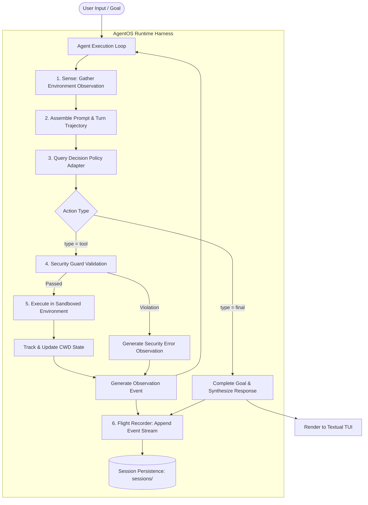
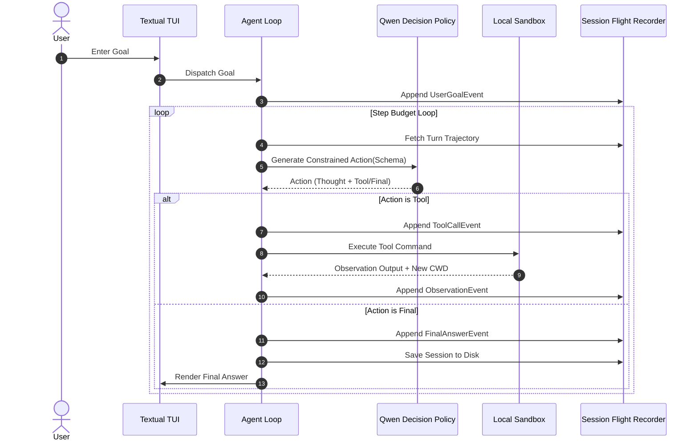

# AgentOS: A From-Scratch Modular Agent Runtime

AgentOS is a modular, local-first runtime and execution harness designed to operate autonomous AI agents using quantized local models (such as Qwen 2.5 / Qwen 3 0.5B-0.6B GGUF) via llama.cpp.

The project is built around a foundational architectural principle:

$$\text{Agent} = \text{Model} + \text{Harness}$$

The Large Language Model is not the agent. The model functions as a stateless reasoning policy, while the runtime harness provides state management, event-sourced flight recording, grammar-constrained decoding, sandboxed execution, exception containment, and working directory confinement.

---

## 1. System Architecture

The runtime implements a strict Sense-Decide-Act control loop decoupled from model backends and operating system primitives.



---

## 2. Core Architectural Pillars

### 2.1 Grammar-Constrained Decoding
Traditional agent frameworks prompt models to return raw JSON and rely on regular expressions with retry loops. On small edge models (0.5B to 3B parameters), this approach yields a 20% to 30% syntax failure rate due to markdown ticks, conversational chatter, and structural deviations.

AgentOS compiles dynamic JSON Schemas derived from registered tools into GBNF (Generalized Backus-Naur Form) grammars via `llama-cpp-python`. Non-compliant tokens are masked at the sampler level with a logit bias of $-\infty$. The syntax failure rate is mathematically zero.

### 2.2 Event-Sourced Flight Recorder & Session Persistence
All interactions within AgentOS are modeled as strongly typed, immutable Pydantic events:
- `UserGoalEvent`: Captures user prompts and session initialization.
- `ToolCallEvent`: Records structured tool selections, thoughts, and arguments.
- `ObservationEvent`: Captures environment return values, exit codes, and errors.
- `FinalAnswerEvent`: Records completed goal resolutions and final reasoning.

Every step is appended to an in-memory trajectory and persisted to disk under `sessions/session_<id>.json`. Sessions can be paused, inspected, and resumed across turns with full history summaries.



### 2.3 Safe Environment Sandbox & Working Directory Confinement
The runtime confines execution to designated project boundaries without requiring heavy virtualization containers:
- **Command Security Guard**: Scans commands against destructive patterns (`rm -rf /`, fork bombs, raw disk writes, formatting commands) before subshell execution.
- **Working Directory Tracking**: Standard `subprocess.run` calls spawn isolated subshells that lose directory changes. The `LocalSandbox` probes directory state via trailing environment markers, persisting `cd` operations across agent turns.
- **Path Confinement**: Prevents relative path escapes (`cd ../../..`) by validating all target paths against `Path.is_relative_to(root_dir)`.

### 2.4 Tagged Union Action Schemas & Reasoning Buffers
Decisions are modeled as discriminated sum types:
```json
{
  "thought": "Brief 1-2 sentence explanation of the immediate step.",
  "type": "tool",
  "tool": "execute_bash",
  "arguments": { "command": "cat README.md" }
}
```
Enforcing explicit `thought` generation before structural argument decoding improves tool selection accuracy and eliminates multi-step execution loops on small language models.

---

## 3. Codebase Layout

```
AgentOS/
├── agent/
│   ├── action.py          # Discriminated union schemas (ToolAction, FinalAction)
│   ├── action_schema.py   # Dynamic oneOf JSON Schema compiler for tool registry
│   ├── agent.py           # Core Sense-Decide-Act execution loop
│   ├── decision.py        # Abstract DecisionMaker policy interface
│   ├── environment.py     # Environment sandbox and error containment boundary
│   ├── events.py          # Strongly typed Pydantic event definitions
│   ├── prompt.py          # Context assembly and positive task-fulfillment prompting
│   ├── qwen_decision.py   # Concrete decision policy using local GGUF weights
│   ├── session.py         # Append-only flight recorder with disk serialization
│   └── ui.py              # Zero-emoji output formatting with Textual sink routing
├── llm/
│   ├── __init__.py
│   └── qwen.py            # llama-cpp-python wrapper with greedy constrained sampling
├── tools/
│   ├── base.py            # Abstract tool base class
│   ├── bash.py            # Sandboxed bash execution tool
│   ├── calculator.py      # Basic arithmetic tool
│   ├── file_creation.py   # Safe file writing tool
│   ├── file_reading.py    # Buffer-capped file reader
│   ├── models.py          # Pydantic validation models for tool inputs
│   ├── registry.py        # Dynamic tool catalog and reflection
│   ├── sandbox.py         # Pure-Python working directory confinement & CWD tracker
│   ├── security.py        # Pre-execution regex security guard
│   └── task.py            # Task completion tracking tool
├── main.py                # Full-screen Textual TUI with anchored bottom input
├── Makefile               # Automated developer tooling (run, download, clean, lint, mypy)
└── pyproject.toml         # Dependency definitions managed via uv
```

---

## 4. Verification and Developer Tooling

AgentOS enforces strict type safety and linting across all source files.

```bash
# Run Flake8 and Mypy checks
make check
```

Output:
```text
uv run flake8 --max-line-length=100 --exclude .venv,__pycache__,build,dist,models .
uv run mypy --exclude .venv agent llm tools main.py
Success: no issues found in 25 source files
```

---

## 5. Quickstart

### Prerequisites
- Linux or macOS
- Python 3.11 or 3.12
- `uv` package manager

### Installation

```bash
# 1. Clone the repository
git clone https://github.com/adam-adra/AgentOS.git
cd AgentOS

# 2. Synchronize dependencies
uv sync

# 3. Download the quantized Qwen GGUF model (~490 MB)
make download-model

# 4. Verify code quality
make check

# 5. Launch the Textual TUI
make run
```

---

## 6. Makefile Targets Reference

- `make / make run`: Launches the interactive AgentOS Textual interface.
- `make download-model`: Downloads the quantized Qwen GGUF weights from HuggingFace.
- `make force-download`: Purges existing weights and triggers a fresh download.
- `make clean-pycache`: Purges `__pycache__`, `.mypy_cache`, and compiled `.pyc` files.
- `make flake8`: Runs Flake8 linter with 100-character line length enforcement.
- `make mypy`: Executes static type checking across all 25 source files.
- `make check`: Runs both `flake8` and `mypy` in sequence.
- `make clean-model`: Deletes model weights from `models/`.
